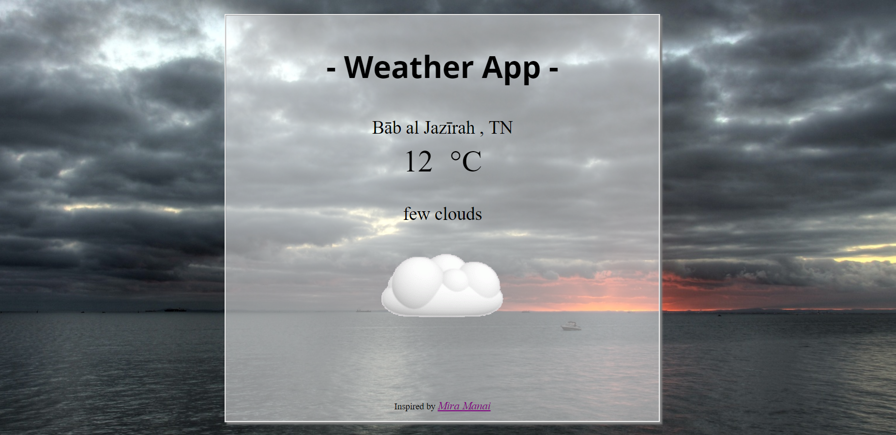

# My Local weather app

	

2. <strong>Rule #1</strong> Figure it out for yourself.

3. <strong>Rule #2</strong> Fulfill the below user stories. Use whichever libraries or APIs you need. I give it my personal style.

4. <strong>User Story</strong> I can see the weather in my current location.

5. <strong>User Story</strong> I can see a different icon or background image (e.g. snow mountain, hot desert) depending on the weather.

6. <strong>User story</strong> I can push a button to toggle between Fahrenheit and Celsius.

7. <strong>User Story</strong> I can see a loading spinner while the application is loading the weather data.